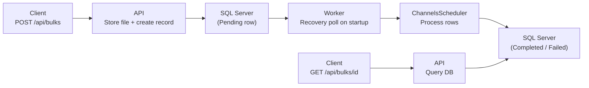

# API + Worker Architecture

This guide shows how to split BulkSharp into two independently deployable processes:

- **API server** (ASP.NET Core Minimal API) - Accepts file uploads, creates operations, and exposes query endpoints. Does not process operations.
- **Worker service** (.NET Worker Service) - Picks up pending operations and processes them in the background.
- **Shared library** - Contains operation definitions, model types, and shared configuration. Referenced by both API and Worker.

## Why split?

In the [ASP.NET Integration](aspnet-integration.md) guide, a single process handles both HTTP requests and background processing. That works for moderate load, but a split architecture provides:

- **Independent scaling** - Scale API and Worker replicas separately based on traffic vs. processing demand.
- **Isolation** - A CPU-intensive bulk operation cannot starve API response times.
- **Deployment flexibility** - Deploy Worker updates (new operation logic) without restarting the API, and vice versa.
- **Resilience** - If the Worker crashes mid-processing, the API continues accepting uploads. The Worker recovers pending operations on restart.

> [!IMPORTANT]
> Both processes must share the same database and file storage. BulkSharp uses optimistic concurrency on operation records, so multiple Workers can safely run in parallel.

## Project structure

```
MyBulkApp/
  MyBulkApp.Shared/          # Operation definitions, models, shared config
  MyBulkApp.Api/              # ASP.NET Core Minimal API
  MyBulkApp.Worker/           # .NET Worker Service
```

## 1. Shared library

The Shared project contains everything both sides need: model types, operation implementations, and a helper for consistent BulkSharp configuration.

### Packages

```bash
dotnet new classlib -n MyBulkApp.Shared
cd MyBulkApp.Shared
dotnet add package BulkSharp
dotnet add package BulkSharp.Data.EntityFramework
```

### Models

```csharp
// Models/UserMetadata.cs
using BulkSharp.Core.Abstractions.Processing;

namespace MyBulkApp.Shared.Models;

public class UserMetadata : IBulkMetadata
{
    public string RequestedBy { get; set; } = string.Empty;
    public string Department { get; set; } = "General";
}
```

```csharp
// Models/UserRow.cs
using BulkSharp.Core.Abstractions.Processing;
using BulkSharp.Core.Attributes;

namespace MyBulkApp.Shared.Models;

[CsvSchema("1.0")]
public class UserRow : IBulkRow
{
    [CsvColumn("FirstName")]
    public string FirstName { get; set; } = string.Empty;

    [CsvColumn("LastName")]
    public string LastName { get; set; } = string.Empty;

    [CsvColumn("Email")]
    public string Email { get; set; } = string.Empty;
}
```

### Operation

```csharp
// Operations/UserImportOperation.cs
using BulkSharp.Core.Abstractions;
using BulkSharp.Core.Attributes;
using BulkSharp.Core.Exceptions;
using MyBulkApp.Shared.Models;

namespace MyBulkApp.Shared.Operations;

[BulkOperation("import-users", Description = "Import users from CSV")]
public class UserImportOperation : IBulkRowOperation<UserMetadata, UserRow>
{
    public Task ValidateMetadataAsync(UserMetadata metadata, CancellationToken ct = default)
    {
        if (string.IsNullOrWhiteSpace(metadata.RequestedBy))
            throw new BulkValidationException("RequestedBy is required.");
        return Task.CompletedTask;
    }

    public Task ValidateRowAsync(UserRow row, UserMetadata metadata, CancellationToken ct = default)
    {
        if (string.IsNullOrWhiteSpace(row.Email) || !row.Email.Contains('@'))
            throw new BulkValidationException($"Invalid email for {row.FirstName} {row.LastName}.");
        return Task.CompletedTask;
    }

    public Task ProcessRowAsync(UserRow row, UserMetadata metadata, CancellationToken ct = default)
    {
        // Your business logic: call an external API, write to a database, etc.
        return Task.CompletedTask;
    }
}
```

### Shared configuration

Create a helper that configures file storage and metadata storage consistently across both processes. The scheduler is left to each process since it differs between API and Worker.

```csharp
// BulkSharpConfig.cs
using BulkSharp;
using BulkSharp.Data.EntityFramework;

namespace MyBulkApp.Shared;

public static class BulkSharpConfig
{
    public static BulkSharpBuilder ConfigureSharedStorage(
        this BulkSharpBuilder builder,
        string connectionString,
        string fileStoragePath)
    {
        return builder
            .UseFileStorage(fs => fs.UseFileSystem(fileStoragePath))
            .UseMetadataStorage(ms => ms.UseSqlServer(opts =>
                opts.ConnectionString = connectionString));
    }
}
```

> [!TIP]
> Both processes must point to the same `fileStoragePath` (or use a shared volume/network drive). If your API and Worker run on different machines, use `BulkSharp.Files.S3` instead of file system storage.

## 2. API server

The API accepts file uploads, creates operations in the database, and exposes query endpoints. It does **not** process operations - that is the Worker's job.

### Packages

```bash
dotnet new web -n MyBulkApp.Api
cd MyBulkApp.Api
dotnet add reference ../MyBulkApp.Shared/MyBulkApp.Shared.csproj
```

The Shared project already references `BulkSharp` and `BulkSharp.Data.EntityFramework`, so no additional packages are needed.

### AddBulkSharpApi()

Use `AddBulkSharpApi()` instead of `AddBulkSharp()` in the API process. This registers only the services the API needs (operation service, query service, file/metadata storage, data format processors) and uses a built-in `NullBulkScheduler` that leaves operations in `Pending` status for the Worker to pick up. No worker threads, hosted services, or processor infrastructure are started.

> [!WARNING]
> `AddBulkSharpApi()` means the API itself will never process operations. If you want the API to also serve as a fallback processor (e.g., in a single-node deployment), use `AddBulkSharp()` instead and accept that both API and Worker may process operations. BulkSharp's optimistic concurrency prevents double-processing.

### Program.cs

```csharp
using BulkSharp;
using BulkSharp.Core.Abstractions.Operations;
using BulkSharp.Core.Domain.Queries;
using MyBulkApp.Shared;

var builder = WebApplication.CreateBuilder(args);

var connectionString = builder.Configuration.GetConnectionString("BulkSharp")!;
var fileStoragePath = builder.Configuration["BulkSharp:FileStoragePath"] ?? "data/uploads";

builder.Services.AddBulkSharpApi(b => b
    .ConfigureSharedStorage(connectionString, fileStoragePath));

var app = builder.Build();

// POST /api/bulks - Create a new bulk operation
app.MapPost("/api/bulks", async (
    IBulkOperationService service,
    HttpRequest request,
    CancellationToken ct) =>
{
    var form = await request.ReadFormAsync(ct);

    var operationName = form["operationName"].ToString();
    var metadataJson = form["metadata"].ToString();
    var file = form.Files.GetFile("file");

    if (file is null)
        return Results.BadRequest(new { error = "File is required." });

    await using var stream = file.OpenReadStream();

    var operationId = await service.CreateBulkOperationAsync(
        operationName,
        stream,
        file.FileName,
        metadataJson,
        "api-user",
        ct);

    return Results.Created($"/api/bulks/{operationId}", new { id = operationId });
});

// POST /api/bulks/validate - Pre-submission validation
app.MapPost("/api/bulks/validate", async (
    IBulkOperationService service,
    HttpRequest request,
    CancellationToken ct) =>
{
    var form = await request.ReadFormAsync(ct);

    var operationName = form["operationName"].ToString();
    var metadataJson = form["metadata"].ToString();
    var file = form.Files.GetFile("file");

    if (file is null)
        return Results.BadRequest(new { error = "File is required." });

    await using var stream = file.OpenReadStream();

    var result = await service.ValidateBulkOperationAsync(
        operationName, metadataJson, stream, file.FileName, ct);

    return result.IsValid
        ? Results.Ok(new { valid = true })
        : Results.UnprocessableEntity(new
        {
            valid = false,
            metadataErrors = result.MetadataErrors,
            fileErrors = result.FileErrors
        });
});

// GET /api/bulks/{id} - Get operation details
app.MapGet("/api/bulks/{id:guid}", async (
    Guid id,
    IBulkOperationQueryService queryService,
    CancellationToken ct) =>
{
    var operation = await queryService.GetBulkOperationAsync(id, ct);
    return operation is not null ? Results.Ok(operation) : Results.NotFound();
});

// GET /api/bulks/{id}/status - Get status and progress
app.MapGet("/api/bulks/{id:guid}/status", async (
    Guid id,
    IBulkOperationQueryService queryService,
    CancellationToken ct) =>
{
    var status = await queryService.GetBulkOperationStatusAsync(id, ct);
    return status is not null ? Results.Ok(status) : Results.NotFound();
});

// GET /api/bulks/{id}/errors - Query errors with pagination
app.MapGet("/api/bulks/{id:guid}/errors", async (
    Guid id,
    IBulkOperationQueryService queryService,
    int page,
    int pageSize,
    string? errorType,
    CancellationToken ct) =>
{
    BulkErrorType? parsedErrorType = null;
    if (!string.IsNullOrEmpty(errorType) && Enum.TryParse<BulkErrorType>(errorType, true, out var et))
        parsedErrorType = et;

    var errors = await queryService.QueryBulkRowRecordsAsync(new BulkRowRecordQuery
    {
        OperationId = id,
        ErrorType = parsedErrorType,
        ErrorsOnly = true,
        Page = page,
        PageSize = pageSize
    }, ct);

    return Results.Ok(errors);
});

// GET /api/bulks/{id}/file - Download original file
app.MapGet("/api/bulks/{id:guid}/file", async (
    Guid id,
    IBulkOperationQueryService queryService,
    IFileStorageProvider fileStorage,
    CancellationToken ct) =>
{
    var operation = await queryService.GetBulkOperationAsync(id, ct);
    if (operation is null)
        return Results.NotFound();

    var stream = await fileStorage.GetFileAsync(operation.FileId, ct);
    return Results.File(stream, "application/octet-stream", operation.FileName);
});

// GET /api/bulks - List operations with filtering
app.MapGet("/api/bulks", async (
    IBulkOperationQueryService queryService,
    int? page,
    int? pageSize,
    string? operationName,
    string? status,
    CancellationToken ct) =>
{
    var query = new BulkOperationQuery
    {
        Page = page ?? 1,
        PageSize = pageSize ?? 25,
        OperationName = operationName
    };

    if (Enum.TryParse<BulkOperationStatus>(status, true, out var parsedStatus))
        query.Status = parsedStatus;

    var result = await queryService.QueryBulkOperationsAsync(query, ct);
    return Results.Ok(result);
});

app.Run();
```

### appsettings.json

```json
{
  "ConnectionStrings": {
    "BulkSharp": "Server=localhost;Database=BulkSharpDb;Trusted_Connection=true;TrustServerCertificate=true"
  },
  "BulkSharp": {
    "FileStoragePath": "data/uploads"
  }
}
```

## 3. Worker service

The Worker picks up pending operations from the database and processes them using the `ChannelsScheduler`.

### Packages

```bash
dotnet new worker -n MyBulkApp.Worker
cd MyBulkApp.Worker
dotnet add reference ../MyBulkApp.Shared/MyBulkApp.Shared.csproj
```

### Program.cs

```csharp
using BulkSharp;
using MyBulkApp.Shared;

var builder = Host.CreateApplicationBuilder(args);

var connectionString = builder.Configuration.GetConnectionString("BulkSharp")!;
var fileStoragePath = builder.Configuration["BulkSharp:FileStoragePath"] ?? "data/uploads";

builder.Services.AddBulkSharp(b => b
    .ConfigureOptions(opts => opts.MaxRowConcurrency = 4)
    .ConfigureSharedStorage(connectionString, fileStoragePath)
    .UseScheduler(s => s.UseChannels(opts =>
    {
        opts.WorkerCount = 4;
        opts.PendingPollInterval = TimeSpan.FromSeconds(5);
        opts.StuckOperationTimeout = TimeSpan.FromMinutes(10);
    })));

var host = builder.Build();
host.Run();
```

That is the entire Worker `Program.cs`. The `ChannelsScheduler` runs as an `IHostedService` that:

1. Starts N worker threads on startup.
2. **Recovers pending operations** - Queries the database for operations in `Pending` status and enqueues them. This is how the Worker picks up operations created by the API.
3. **Polls for new pending operations** - When `PendingPollInterval` is set, a background poller continuously checks the database for new `Pending` operations created by the API and enqueues them. Duplicate detection prevents the same operation from being enqueued twice.
4. **Recovers stuck operations** - When `StuckOperationTimeout` is set, operations stuck in `Running` beyond the timeout are marked `Failed` so they can be investigated or resubmitted. This handles crash scenarios where the previous Worker died mid-processing.
5. Processes operations with configurable concurrency.
6. Drains gracefully on shutdown.

### appsettings.json

```json
{
  "ConnectionStrings": {
    "BulkSharp": "Server=localhost;Database=BulkSharpDb;Trusted_Connection=true;TrustServerCertificate=true"
  },
  "BulkSharp": {
    "FileStoragePath": "data/uploads"
  }
}
```

> [!IMPORTANT]
> The connection string and file storage path must match the API's configuration. Both processes read and write to the same database and file storage location.

## How operations flow



1. A client POSTs a file to the API.
2. The API stores the file, creates a `Pending` operation record in SQL Server, and returns immediately.
3. The Worker's `ChannelsScheduler` recovers pending operations from the database on startup and periodically as new ones appear.
4. Workers process each operation: stream rows from the file, validate, execute business logic, and record errors.
5. The operation transitions to `Completed`, `CompletedWithErrors`, or `Failed`.
6. The client queries the API for status and errors at any time.

## Running both together

### Database setup

BulkSharp manages its own schema via EF Core. Run migrations or let the application create the schema on first use:

```bash
# From the API or Worker project directory
dotnet ef database update --project ../MyBulkApp.Shared
```

Or use `EnsureCreated` in development by adding this to either `Program.cs`:

```csharp
using var scope = app.Services.CreateScope();
var db = scope.ServiceProvider.GetRequiredService<BulkSharpDbContext>();
await db.Database.EnsureCreatedAsync();
```

### Start both processes

```bash
# Terminal 1 - API
dotnet run --project MyBulkApp.Api

# Terminal 2 - Worker
dotnet run --project MyBulkApp.Worker
```

### Test the flow

```bash
# Create a CSV file
cat > users.csv << 'EOF'
FirstName,LastName,Email
Alice,Johnson,alice@example.com
Bob,Smith,bob@example.com
Charlie,Brown,invalid-email
EOF

# Upload via API
curl -X POST http://localhost:5000/api/bulks \
  -F "operationName=import-users" \
  -F "metadata={\"RequestedBy\":\"admin\",\"Department\":\"Engineering\"}" \
  -F "file=@users.csv"

# Response: { "id": "3fa85f64-..." }

# Check status (the Worker processes it asynchronously)
curl http://localhost:5000/api/bulks/3fa85f64-.../status

# Query errors
curl "http://localhost:5000/api/bulks/3fa85f64-.../errors?page=1&pageSize=50"
```

## Production considerations

### Shared file storage

When the API and Worker run on different machines, local file system storage will not work. Use one of:

- **Network file share** - Mount the same path on both machines. Simple but introduces a network dependency.
- **Amazon S3** - Use `BulkSharp.Files.S3` for durable, scalable file storage:

```csharp
// In BulkSharpConfig.ConfigureSharedStorage:
builder.UseFileStorage(fs => fs.UseS3(opts =>
{
    opts.BucketName = "my-bulk-uploads";
    opts.Region = "us-east-1";
}));
```

### Multiple Worker instances

You can run multiple Worker instances for horizontal scaling. The `ChannelsScheduler` on each instance independently recovers pending operations from the database. BulkSharp's optimistic concurrency (`RowVersion`) on the operation record ensures that only one Worker processes a given operation - the others will see a concurrency conflict and skip it.

### Health checks

Add health checks to both processes to verify database and storage connectivity:

```csharp
// API
builder.Services.AddHealthChecks()
    .AddSqlServer(connectionString);

app.MapHealthChecks("/health");
```

### Cancellation

To cancel a running operation, POST to the API and have the Worker check the operation status:

```bash
curl -X POST http://localhost:5000/api/bulks/{id}/cancel
```

Since the API uses `AddBulkSharpApi()` with `NullBulkScheduler`, the cancel call updates the operation status in the database. The Worker's `ChannelsScheduler` detects the cancellation on its next status check.

## Next Steps

- [Testing](testing.md) - Use in-memory providers for unit and integration tests
- [Step-Based Operations](../guides/step-operations.md) - Break processing into multiple steps with retry
- [S3 Storage](../guides/s3-storage.md) - Use Amazon S3 for file storage
- [Production Deployment](../guides/production.md) - Scaling, monitoring, and security
