# BulkSharp Architecture Overview

## What BulkSharp Does

BulkSharp is a .NET 8 library for production-grade bulk data processing. It accepts files (CSV, JSON), parses them into typed rows, validates each row against user-defined rules, and processes them through either single-pass or multi-step pipelines. It provides pluggable storage, scheduling, and a Blazor monitoring dashboard.

Design philosophy:

- **Pluggable everything.** File storage, metadata persistence, and scheduling are independently configurable.
- **Correctness over cleverness.** Thread-safe counters via `Interlocked`, optimistic concurrency with `RowVersion`, explicit state machine transitions.
- **Production-first.** Backpressure handling, graceful shutdown, crash recovery, batched error flushing.

---

## Component Layers

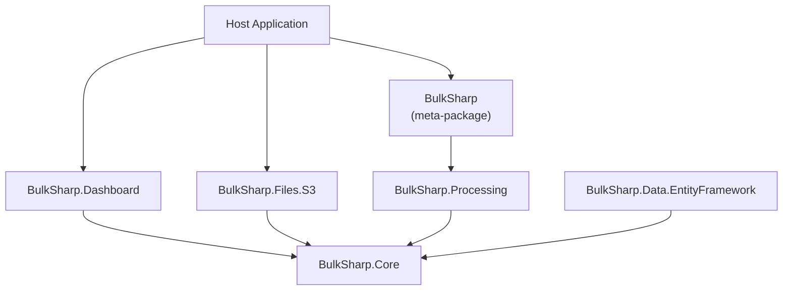

All packages depend downward on **Core**. The meta-package **BulkSharp** references **Core** and **Processing** and provides the `AddBulkSharp()` DI entry point. Extension packages (**Dashboard**, **Files.S3**, **Data.EntityFramework**) are opt-in.

---

## Package Dependency Graph

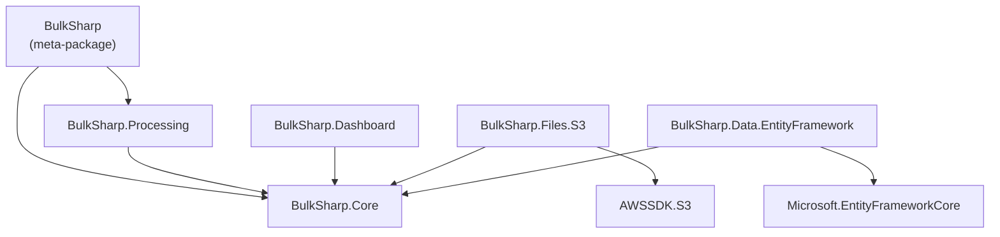

---

## Processing Pipeline

End-to-end flow from file upload to completion:

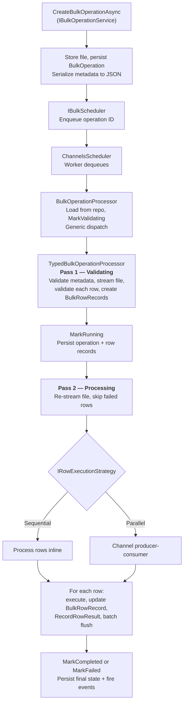

### Key Details

- **Two-pass streaming**: Pass 1 (Validating) validates rows and creates `BulkRowRecord` tracking records (StepIndex=-1). Pass 2 (Processing) re-streams the file and executes only valid rows. Both passes stream without buffering the entire file.
- **Format detection**: `IDataFormatProcessorFactory<TRow>` selects CSV or JSON parser based on file extension.
- **Row streaming**: Parsers yield rows via `IAsyncEnumerable<TRow>`, keeping memory pressure low for large files.
- **Record batching**: Row record creates and updates accumulate and flush periodically (every 1 second in parallel mode, every `FlushBatchSize` rows in sequential mode).
- **Generic dispatch**: `BulkOperationProcessor` uses cached `MakeGenericMethod` to dispatch to `TypedBulkOperationProcessor<T, TMetadata, TRow>` at runtime. This is a typed factory pattern, not service locator.
- **Event hooks**: Lifecycle events fire at each status transition. See [Event Hooks](#event-hooks).

---

## Operation Lifecycle State Machine

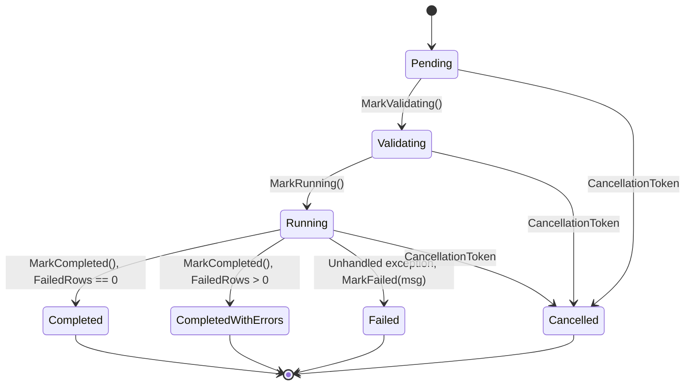

### State Transition Rules

| From | To | Trigger |
|---|---|---|
| Pending | Validating | `MarkValidating()` - processor starts validation phase |
| Validating | Running | `MarkRunning()` - validation complete, processing starts |
| Running | Completed | `MarkCompleted()` - all rows succeeded (FailedRows == 0) |
| Running | CompletedWithErrors | `MarkCompleted()` - some rows failed (FailedRows > 0) |
| Running | Failed | `MarkFailed(msg)` - unhandled exception in pipeline |
| Pending, Validating, Running | Cancelled | `MarkCancelled()` - cancellation token triggered |
| Any terminal state | (no-op) | `MarkFailed()` returns early; other transitions throw `InvalidOperationException` |

Terminal states: **Completed**, **CompletedWithErrors**, **Failed**, **Cancelled**.

---

## Three Pluggable Axes

Configuration is done through `BulkSharpBuilder` with three independent axes. Each can only be configured once (double-configuration throws).

```csharp
services.AddBulkSharp(builder => builder
    .UseFileStorage(fs => ...)
    .UseMetadataStorage(ms => ...)
    .UseScheduler(s => ...));
```

### 1. File Storage (`UseFileStorage`)

Where uploaded files are physically stored.

| Provider | Registration | Notes |
|---|---|---|
| File System | `fs.UseFileSystem(opts => opts.BasePath = "...")` | Default. Local disk. |
| In-Memory | `fs.UseInMemory()` | Testing only. |
| S3 | `fs.UseS3(opts => ...)` | Via `BulkSharp.Files.S3` package. |
| Custom | `fs.UseCustom<T>()` | Implement `IFileStorageProvider`. |

Single interface: `IFileStorageProvider` (store/retrieve/delete + metadata, listing).

### 2. Metadata Storage (`UseMetadataStorage`)

Where operation records, errors, and file metadata are persisted.

| Provider | Registration | Notes |
|---|---|---|
| In-Memory | `ms.UseInMemory()` | Default. Lost on restart. |
| SQL Server | `ms.UseSqlServer(opts => ...)` | Direct ADO.NET. |
| Entity Framework | `ms.UseEntityFramework<TContext>(...)` | Via `BulkSharp.Data.EntityFramework`. |
| Custom | Implement `IBulkOperationRepository`, `IBulkRowRecordRepository`, `IBulkFileRepository` | |

### 3. Scheduling (`UseScheduler`)

How operations are queued and dispatched to workers.

| Scheduler | Registration | Notes |
|---|---|---|
| Channels | `s.UseChannels(opts => ...)` | Default. Production-grade. |
| Immediate | `s.UseImmediate()` | Synchronous inline. Testing only. |
| Custom | `s.UseCustom<T>()` | Implement `IBulkScheduler`. |

---

## Deployment Topologies

### Single-Process (default)

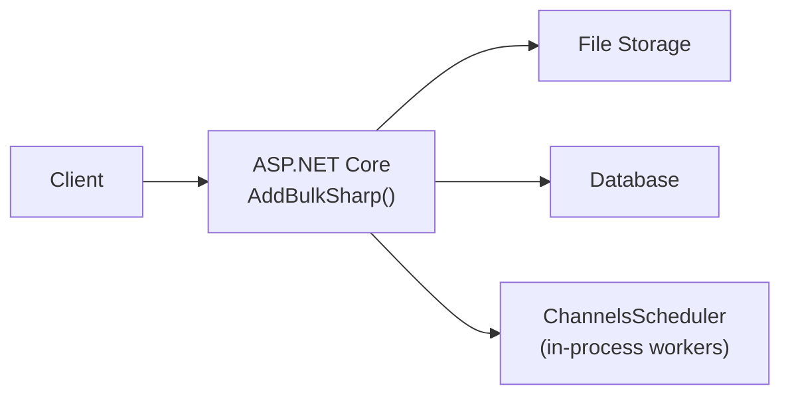

Use `AddBulkSharp()` for a single process that handles both HTTP requests and background processing. Suitable for moderate load and simpler deployments.

### Split API + Worker

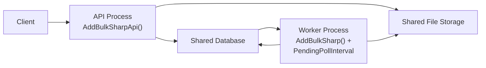

Use `AddBulkSharpApi()` in the API process and `AddBulkSharp()` with `PendingPollInterval` in the Worker. The API stores operations as `Pending`; the Worker polls for and processes them. See [API + Worker Architecture](../getting-started/api-worker.md) for a full walkthrough.

Key differences:

| | API (`AddBulkSharpApi`) | Worker (`AddBulkSharp`) |
|---|---|---|
| **Scheduler** | `NullBulkScheduler` (no-op) | `ChannelsScheduler` with polling |
| **Hosted services** | None | Workers + orphaned step recovery |
| **Processor** | Not registered | Full pipeline |
| **Services** | Operation service, query service, storage, data formats | Everything |

### Multi-Service Gateway

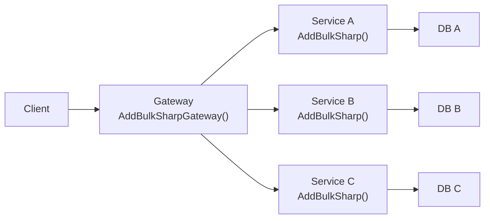

Use `BulkSharp.Gateway` when multiple backend services each run BulkSharp with domain-specific operations and a single Dashboard UI needs unified access. See [Gateway](gateway.md) for setup.

---

## Threading Model

### ChannelsScheduler

The production scheduler uses `System.Threading.Channels` with a bounded queue for backpressure.

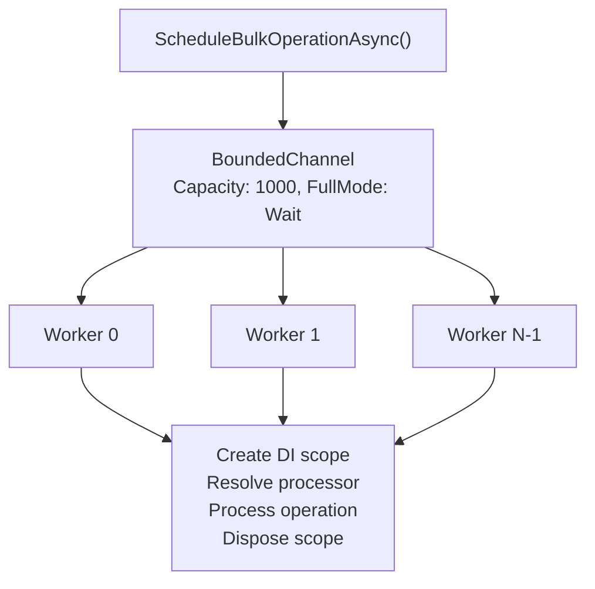

**Key behaviors:**

- **Bounded queue** (default capacity 1000). `FullMode.Wait` blocks producers when full - prevents memory exhaustion. `DropWrite` and `DropOldest` are disallowed (would silently lose operations).
- **Configurable worker count** (`WorkerCount`, default 4). Each worker runs `ReadAllAsync` on the channel reader.
- **Per-operation CancellationTokenSource** linked to the shutdown token. Enables individual operation cancellation without stopping the scheduler.
- **Crash recovery**: On startup, queries the repository for operations stuck in `Pending` status and re-enqueues them.
- **Graceful shutdown**: Completes the channel writer, waits up to `ShutdownTimeout` (default 30s) for workers to drain, then force-cancels.

### Parallel Row Processing

When `MaxRowConcurrency > 1`, `ParallelRowExecutionStrategy` uses a second channel layer inside row processing:

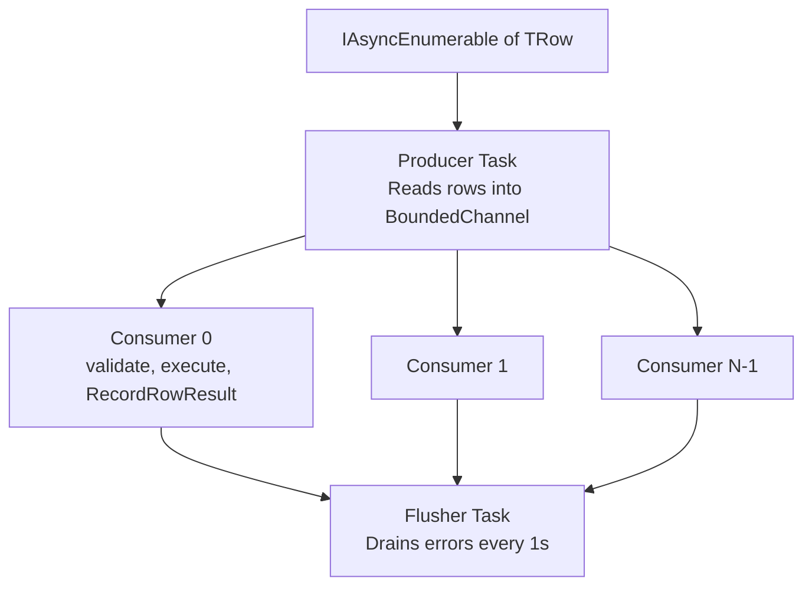

- **Channel capacity**: `MaxRowConcurrency * 2` - enough buffer to keep consumers fed without excessive memory.
- **Thread safety**: Row counters use `Interlocked.Increment`. Error collection uses `ConcurrentBag<T>`.
- **Periodic flushing**: A background task flushes accumulated row record creates and updates every second. A final flush runs after all consumers complete.

---

## Data Flow Summary

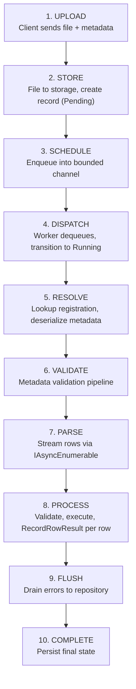

---

## Interface Hierarchy

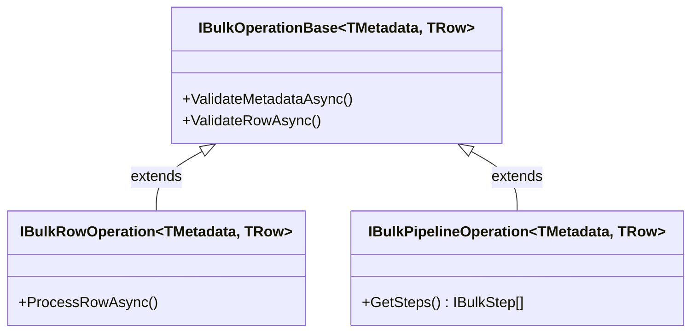

Step-based operations support:

- **Explicit steps**: Override `GetSteps()` to return `IBulkStep<TMetadata, TRow>` instances with `Name`, `MaxRetries`, `ExecuteAsync`.
- **Attribute-based steps**: Methods annotated with `[BulkStep(name, order, maxRetries)]` are auto-discovered and merged with `GetSteps()` results. Duplicate names are deduped (explicit wins).
- **Hybrid**: Return async class-based steps from `GetSteps()` and define sync steps as `[BulkStep]` methods — the framework merges both automatically.
- **Retry with backoff**: `IBulkStepExecutor` handles per-step retry with exponential backoff.

---

## Row Tracking

Every row processed by BulkSharp gets one or more `BulkRowRecord` entries that track its lifecycle. A unified model covers validation, processing, errors, and async step completion in a single table.

- `StepIndex = -1` -- Validation-phase record (one per row)
- `StepIndex >= 0` -- Execution-phase record (one per step per row)

```
Pending -> Running -> Completed | Failed | WaitingForCompletion -> Completed | TimedOut
```

Records are created during the first pass (validation) and updated during the second pass (execution). Both passes stream without buffering the entire file.

By default, only status, timestamps, and error information are stored. To persist the raw row data as serialized JSON, opt in via the `[BulkOperation]` attribute:

```csharp
[BulkOperation("import-users", TrackRowData = true)]
public class UserImportOperation : IBulkRowOperation<UserMetadata, UserRow> { ... }
```

Query row records via `IBulkRowRecordRepository`:

```csharp
var errors = await rowRecordRepo.QueryAsync(new BulkRowRecordQuery
{
    OperationId = operationId,
    ErrorsOnly = true,
    Page = 1,
    PageSize = 50
});
```

---

## Event Hooks

BulkSharp provides an event hook system for reacting to operation lifecycle changes without coupling to the processing pipeline.

### IBulkOperationEventHandler

Handlers implement `IBulkOperationEventHandler`, which uses default interface methods so you only override what you need:

```csharp
public class AuditLogHandler : IBulkOperationEventHandler
{
    public Task OnOperationCompletedAsync(BulkOperationCompletedEvent e, CancellationToken ct)
    {
        // Log completion to audit system
    }

    public Task OnOperationFailedAsync(BulkOperationFailedEvent e, CancellationToken ct)
    {
        // Alert on failure
    }
}
```

### Event Types

| Event | Fires When |
|---|---|
| `BulkOperationCreatedEvent` | Operation is created via `IBulkOperationService` |
| `BulkOperationStatusChangedEvent` | Any status transition (includes `PreviousStatus`) |
| `BulkOperationCompletedEvent` | Operation finishes successfully (includes row counts and duration) |
| `BulkOperationFailedEvent` | Operation fails (includes error message) |
| `BulkRowFailedEvent` | Individual row fails validation or processing |

### Semantics

- All registered handlers run **in parallel** via `Task.WhenAll`.
- A failing handler is **logged but never blocks** processing. Events are fire-and-forget.
- Register handlers via the builder: `builder.AddEventHandler<MyHandler>()`.

---

## Configuration Options

### BulkSharpOptions

| Option | Default | Description |
|---|---|---|
| `MaxFileSizeBytes` | 100 MB | Maximum upload size. 0 disables. |
| `IncludeRowDataInErrors` | `false` | Serialize row data into error records. PII risk - disable in production. |
| `FlushBatchSize` | 100 | Rows between progress flushes in sequential mode. |
| `MaxRowConcurrency` | 1 | Parallel row consumers. 1 = sequential (backward compatible). |
| `EnableOrphanedStepRecovery` | `false` | Recover signal-based async steps stuck in WaitingForCompletion on restart. |

### ChannelsSchedulerOptions

| Option | Default | Description |
|---|---|---|
| `WorkerCount` | 4 | Concurrent operation workers. |
| `QueueCapacity` | 1000 | Bounded channel capacity. |
| `FullMode` | `Wait` | Backpressure strategy. `DropWrite`/`DropOldest` disallowed. |
| `ShutdownTimeout` | 30s | Grace period before force-cancelling workers. |
| `PendingPollInterval` | `null` | Interval for polling the database for new Pending operations. `null` disables. Set when using split API + Worker. |
| `StuckOperationTimeout` | `null` | Operations stuck in Running beyond this duration are marked Failed. `null` disables. |
