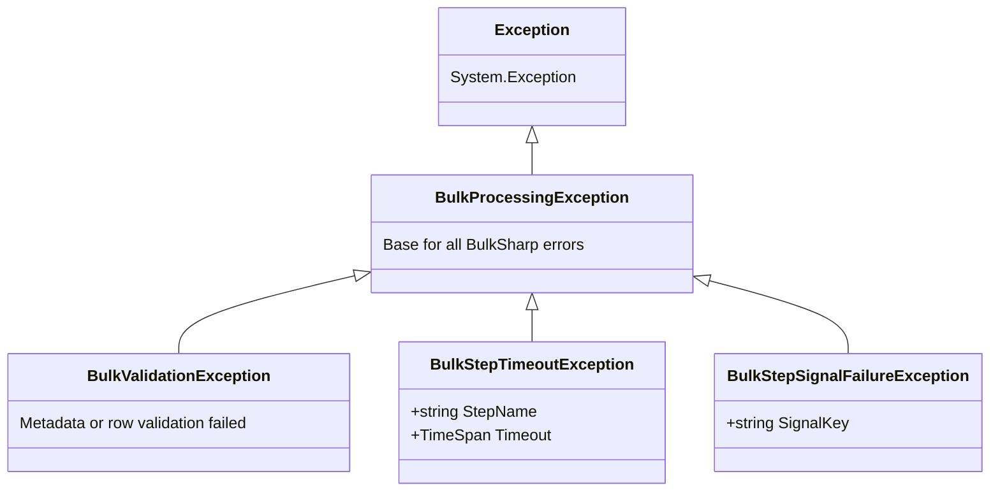
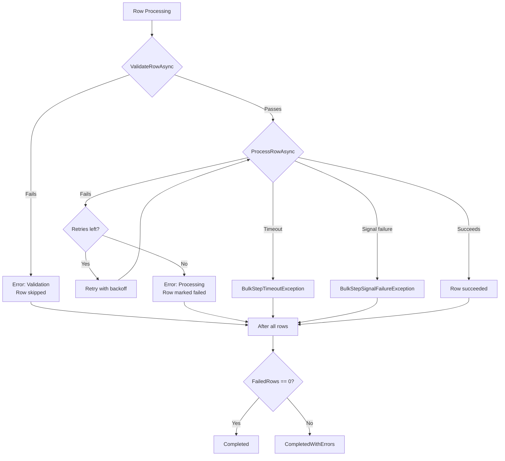

# Exception Hierarchy and Error Types

This guide covers every exception type in BulkSharp, the error classification system, and how errors are collected and persisted during operation processing.

## Exception Hierarchy



All BulkSharp exceptions derive from `BulkProcessingException`, which itself extends `System.Exception`. This makes it straightforward to catch all library-specific errors in a single handler while still allowing granular handling when needed.

## Exception Types

### BulkProcessingException

**Namespace:** `BulkSharp.Core.Exceptions`

The base exception for all non-recoverable processing errors. Thrown when a row or operation encounters a failure that cannot be retried.

```csharp
try
{
    await service.ProcessAsync(operationId, cancellationToken);
}
catch (BulkProcessingException ex)
{
    // Catches any BulkSharp-specific error
    logger.LogError(ex, "Operation {Id} failed", operationId);
}
```

**When thrown:**
- A step exhausts all retry attempts (`MaxRetries`)
- An unrecoverable error occurs during row processing
- Used as the base type when a more specific subclass does not apply

### BulkValidationException

**Namespace:** `BulkSharp.Core.Exceptions`
**Inherits:** `BulkProcessingException`

Thrown when metadata or row validation fails.

**When thrown:**
- `ValidateMetadataAsync` rejects the operation metadata (operation-level failure)
- `ValidateRowAsync` rejects a specific row (row-level error, recorded and processing continues)
- A registered `IBulkMetadataValidator<TMetadata>` fails

```csharp
public Task ValidateMetadataAsync(ImportMetadata metadata, CancellationToken ct)
{
    if (string.IsNullOrWhiteSpace(metadata.TargetTable))
        throw new BulkValidationException("TargetTable is required");

    return Task.CompletedTask;
}
```

### BulkStepTimeoutException

**Namespace:** `BulkSharp.Core.Exceptions`
**Inherits:** `BulkProcessingException`

Thrown when an async bulk step exceeds its configured timeout waiting for external completion.

**When thrown:**
- A polling-based async step (`StepCompletionMode.Polling`) polls beyond its timeout
- A signal-based async step (`StepCompletionMode.Signal`) does not receive a signal within the timeout

**Constructor:** `BulkStepTimeoutException(string stepName, TimeSpan timeout)`

The exception message includes the step name and elapsed timeout in seconds.

```
Async step 'ExternalApproval' timed out after 300s waiting for completion
```

When this exception is caught by the step executor, the row record state is set to `RowRecordState.TimedOut`.

### BulkStepSignalFailureException

**Namespace:** `BulkSharp.Core.Exceptions`
**Inherits:** `BulkProcessingException`

Thrown when an external process signals that an async step has failed. The error message originates from the signaling process.

**When thrown:**
- `BulkStepSignalService.SignalFailureAsync` is called by an external system to indicate that the async work failed

**Properties:**
- `SignalKey` (string) - The signal key that identifies the row/step combination

```csharp
// External system signals failure
await signalService.SignalFailureAsync(signalKey, "Payment gateway rejected transaction");
// This causes a BulkStepSignalFailureException on the waiting step
```

## BulkErrorType Enum

The `BulkErrorType` enum in `BulkSharp.Core.Domain.Operations` classifies per-row errors:

| Value | Used When |
|-------|-----------|
| `Validation` | Row fails `ValidateRowAsync` or a composed `IBulkRowValidator` |
| `Processing` | Row fails during `ProcessRowAsync` or simple row execution |
| `StepFailure` | A pipeline step fails after exhausting all retries |
| `Timeout` | An async step times out waiting for external completion |
| `SignalFailure` | An external signal reports a failure |

These values are stored in `BulkRowRecord.ErrorType` and can be used to filter errors in queries.

## BulkRowRecord as Error Record

Per-row errors are stored as `BulkRowRecord` entries with `ErrorType` and `ErrorMessage` set. The same model tracks both successful and failed rows:

```csharp
public sealed class BulkRowRecord
{
    public Guid Id { get; set; }
    public Guid BulkOperationId { get; set; }
    public int RowNumber { get; set; }
    public string? RowId { get; set; }
    public string StepName { get; set; }
    public int StepIndex { get; set; }          // -1 = validation, 0+ = execution steps
    public RowRecordState State { get; set; }
    public BulkErrorType? ErrorType { get; set; }
    public string? ErrorMessage { get; set; }
    public string? RowData { get; set; }
    public string? SignalKey { get; set; }
    public DateTime CreatedAt { get; set; }
    public DateTime? StartedAt { get; set; }
    public DateTime? CompletedAt { get; set; }
}
```

When a row fails, `MarkFailed(message, errorType)` sets the state to `Failed` and populates the error fields.

## Error Batching and Flush Behavior

Row records (including those with errors) are not written to storage one at a time. They are collected and flushed periodically for performance.

### How Flushing Works

1. During row processing, record creates and updates are tracked in an in-memory pending collection.
2. A background flush loop runs every 1 second, draining the pending records and writing them via `IRowRecordFlushService.FlushAsync`.
3. After all rows complete, a final flush ensures no records are lost.

### FlushBatchSize

The `BulkSharpOptions.FlushBatchSize` (default: 100) controls the batch size for error writes and status updates. This affects:

- How many row records are written per database round-trip
- The delay between a record being created/updated and it appearing in query results

```csharp
services.AddBulkSharp(builder => builder
    .ConfigureOptions(opts => opts.FlushBatchSize = 50));  // Smaller batches, more frequent writes
```

**Tradeoffs:**
- Lower values: errors appear faster in queries but increase database write frequency
- Higher values: better throughput but errors may not be visible until the batch fills or the flush timer fires

### Implications

- During processing, row records may not appear immediately in query results. They are guaranteed to be persisted once the operation completes.
- The 1-second flush interval means errors typically appear within 1-2 seconds even if the batch size has not been reached.

## IncludeRowDataInErrors

By default, `BulkRowRecord.RowData` is null. Row data is stored when the operation is decorated with `[BulkOperation("name", TrackRowData = true)]`. The row is serialized to JSON during the validation phase and stored in the validation record's `RowData` field.

```csharp
services.AddBulkSharp(builder => builder
    .ConfigureOptions(opts => opts.IncludeRowDataInErrors = true));
```

**Security warning:** Row data may contain PII or sensitive information. Do not enable this in production unless you have appropriate data handling controls in place. The serialized data uses `System.Text.Json.JsonSerializer.Serialize(row)`.

## Error Flow Summary


