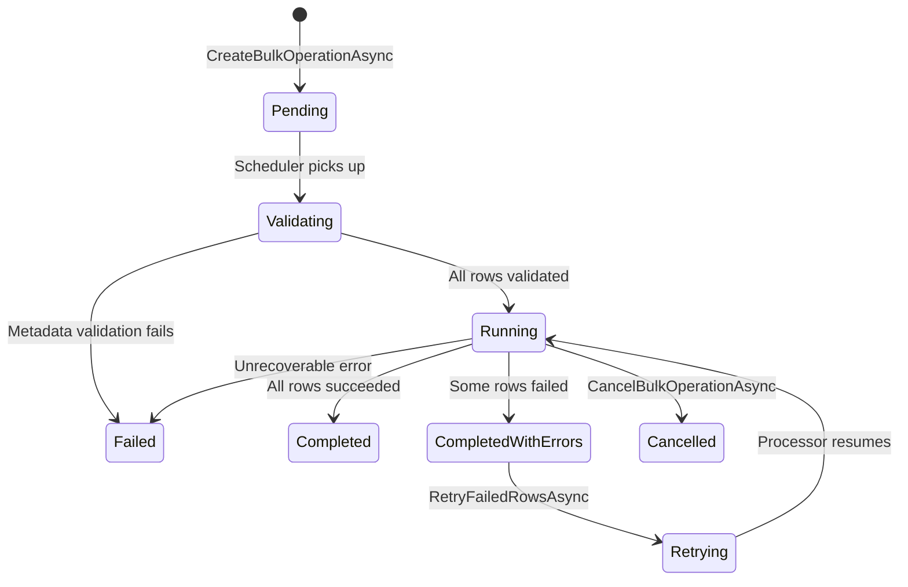
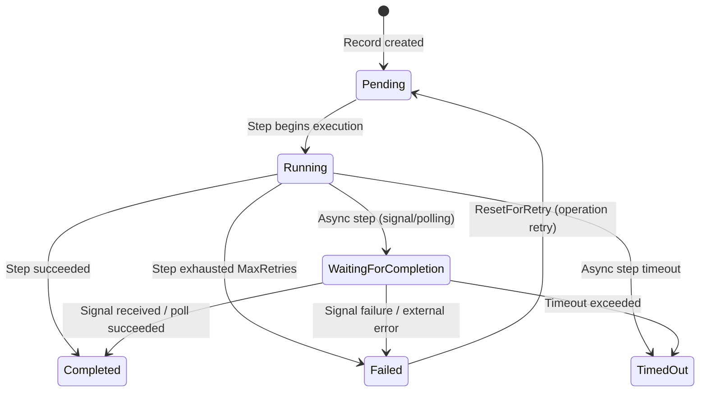

# State Machine Guide

BulkSharp uses explicit state machines at both the operation and row levels. Every transition is deterministic and auditable.

---

## Operation-Level State Machine

An operation moves through a well-defined lifecycle from creation to completion (or failure).



### Status Descriptions

| Status | Meaning |
|--------|---------|
| `Pending` | Created and stored, waiting for a scheduler worker to pick it up. |
| `Validating` | Streaming the file, running metadata and row validation. Row records are created during this phase. |
| `Running` | Processing rows (single-pass or multi-step pipeline). |
| `Completed` | All rows processed successfully. |
| `CompletedWithErrors` | Processing finished but one or more rows failed. Eligible for retry if configured. |
| `Failed` | Operation-level failure: metadata validation, file parse error, or unrecoverable exception. |
| `Cancelled` | User-initiated cancellation via `CancelBulkOperationAsync`. |
| `Retrying` | Transitional state after `RetryFailedRowsAsync` is called. The scheduler re-queues the operation and the processor transitions it to `Running`. |

### Key Transitions

- **Pending to Validating**: The scheduler worker dequeues the operation and the processor begins the validation phase.
- **Validating to Running**: After all rows are streamed and validated, the processor transitions to the processing phase.
- **Running to CompletedWithErrors**: The processor finishes all rows but at least one row has a Failed or TimedOut state.
- **CompletedWithErrors to Retrying**: `RetryFailedRowsAsync` snapshots error history, resets failed row records, and re-schedules the operation.
- **Retrying to Running**: The processor detects the `Retrying` status and enters the retry path, transitioning to `Running` immediately.

---

## Row-Level State Machine

Each row is tracked independently via `BulkRowRecord` entries. In pipeline operations, there is one record per step per row (identified by `StepIndex`). Validation records use `StepIndex = -1`.



### Row Record States

| State | Meaning |
|-------|---------|
| `Pending` | Row record created but step not yet started. Also the state after `ResetForRetry`. |
| `Running` | Step is actively executing for this row. |
| `WaitingForCompletion` | Async step started; waiting for polling success or external signal. |
| `Completed` | Step finished successfully. |
| `Failed` | Step failed after exhausting retries (per-step) or received a failure signal. |
| `TimedOut` | Async step exceeded its configured `Timeout`. |

### Validation Records (StepIndex = -1)

During the validation phase, a record is created for each row at `StepIndex = -1`. This record stores:
- The validation result (Completed or Failed with `BulkErrorType.Validation`)
- The serialized row data (when `TrackRowData = true`)
- The row's business key (`RowId`)

Rows that fail validation are never processed. Their `StepIndex = -1` records remain as-is and are excluded from retry operations.

### Retry Cycle

When an operation-level retry is triggered:
1. Failed row records are identified (those with `StepIndex >= 0`)
2. Error snapshots are saved to `BulkRowRetryHistory`
3. `ResetForRetry(stepIndex)` is called: state resets to `Pending`, `RetryAttempt` increments, `RetryFromStepIndex` is set
4. The processor resumes from the failing step, skipping completed earlier steps

---

## Full Walkthrough: Multi-Step Async Pipeline with Retry

This section traces a complete lifecycle of a pipeline operation with async steps, partial failure, and retry.

### 1. Operation Creation and File Upload

```
Client calls CreateBulkOperationAsync("device-provisioning", fileStream, ...)
  -> File stored via IFileStorageProvider
  -> BulkOperation created: Status = Pending, TotalRows = 0
  -> Scheduler enqueues the operation ID
```

The operation sits in `Pending` until a scheduler worker picks it up.

### 2. Validation Phase

```
Processor picks up operation -> Status = Validating
  -> Stream file row by row
  -> For each row:
       Run IBulkRowValidator<TMetadata, TRow> validators
       Run operation.ValidateRowAsync(row, metadata)
       Create BulkRowRecord: StepIndex = -1, State = Completed (or Failed if validation threw)
       If TrackRowData: serialize row JSON into RowData
  -> Flush records in batches (FlushBatchSize)
  -> Set TotalRows = rowCount
```

Rows that fail validation are recorded with `BulkErrorType.Validation` at `StepIndex = -1`. These rows are skipped during processing and excluded from retry.

### 3. Processing Phase (Step-by-Step)

```
Status = Running
For each valid row (not in failedRowIndexes):
  Step 0: SIM Activation (sync, MaxRetries=2)
    -> IBulkStepRecordManager.CreateStepRecordAsync: StepIndex=0
    -> IBulkStepExecutor.ExecuteStepAsync: Running -> Completed
  Step 1: Network Registration (sync, no retries)
    -> RecordManager creates record: StepIndex=1
    -> Executor executes: Running -> Completed
  Step 2: Profile Push (async polling)
    -> RecordManager creates record: StepIndex=2
    -> Executor executes: Running -> WaitingForCompletion
    -> Poll every 2s until CheckCompletionAsync returns true
    -> RecordManager transitions: Completed (or TimedOut after 20s)
  Step 3: Carrier Approval (async signal)
    -> RecordManager creates record: StepIndex=3
    -> Executor executes: Running -> WaitingForCompletion
    -> Waits for POST /api/bulks/{id}/signal/{key}
    -> RecordManager transitions: Completed (or TimedOut after 45s)
  Step 4: Customer Notification (sync, MaxRetries=1)
    -> RecordManager creates record: StepIndex=4
    -> Executor executes: Running -> Completed
```

Step execution uses two collaborating components:
- **`IBulkStepRecordManager`** owns record lifecycle: creation, loading, and state transitions (Running, Completed, Failed, etc.)
- **`IBulkStepExecutor`** owns execution: per-step retry with backoff, async completion handling (polling/signal), and delegation of state changes to the record manager

This separation is critical for retry support — the initial path calls `CreateStepRecordAsync` (new records), while the retry path calls `GetStepRecordAsync` (existing records). Both paths use the same executor, preserving all execution features.

If any step fails after exhausting its `MaxRetries`, the row is marked Failed and remaining steps are skipped.

### 4. Completion with Errors

```
All rows processed
  -> Some rows failed at step 1 (Network Registration)
  -> Some rows timed out at step 3 (Carrier Approval)
  -> Counters: ProcessedRows=100, SuccessfulRows=92, FailedRows=8
  -> Status = CompletedWithErrors
```

### 5. Retry: Eligibility Check

```
Client calls CanRetryAsync(operationId)
  -> Operation status is CompletedWithErrors? Yes
  -> Operation IsRetryable? Yes (from attribute or interface)
  -> TrackRowData enabled? Yes
  -> RetryCount < MaxRetryAttempts? Yes
  -> Has retryable failed rows (StepIndex >= 0)? Yes
  -> Result: Eligible
```

### 6. Retry: Error Snapshot

```
Client calls RetryFailedRowsAsync(operationId, request)
  -> Query failed rows (StepIndex >= 0)
  -> For each failed row:
       Check step-level AllowOperationRetry (skip if false)
       Create BulkRowRetryHistory snapshot:
         { RowNumber, StepIndex, Attempt, ErrorType, ErrorMessage, FailedAt, RowData }
```

The `BulkRowRetryHistory` preserves the exact error state before retry, creating an audit trail across attempts.

### 7. Retry: Row Reset and Re-Schedule

```
For each retryable row:
  If RowData is null on step record, copy from validation record (StepIndex=-1)
  Call ResetForRetry(stepIndex):
    State = Pending
    RetryAttempt++
    RetryFromStepIndex = stepIndex (the step that failed)
    ErrorMessage = null, ErrorType = null

Operation.MarkRetrying() -> Status = Retrying, RetryCount++
Scheduler re-queues operation
```

### 8. Retry: Resume Processing

```
Processor detects Status = Retrying
  -> Status = Running
  -> Load retry rows: State=Pending, MinRetryAttempt >= 1
  -> For each row:
       Deserialize TRow from RowData
       Resume from RetryFromStepIndex (skip already-completed steps)
       For each step from RetryFromStepIndex:
         IBulkStepRecordManager.GetStepRecordAsync -> load existing record
         IBulkStepRecordManager.MarkRunningAsync -> reset to Running
         IBulkStepExecutor.ExecuteStepAsync -> execute with same retry/async logic
```

For a row that failed at step 1 (Network Registration), step 0 (SIM Activation) is skipped. The record manager loads the existing step 1 record (the one that previously failed), marks it Running, and the executor re-processes it. All executor features — per-step MaxRetries, async completion, signal handling — work identically to the initial path.

### 9. Counter Recalculation

```
After all retry rows processed:
  -> Query ALL row records for this operation
  -> Group by RowNumber, take highest StepIndex per row
  -> Count Completed vs Failed/TimedOut states
  -> RecalculateCounters(successCount, failCount, totalRows)
  -> Determine final status: Completed or CompletedWithErrors
```

Counter recalculation after retry ensures accuracy. It does not rely on incremental counters -- it re-derives totals from the actual row record states.

---

## Error History

`BulkRowRetryHistory` preserves a snapshot of each failed row's state before retry. This creates a complete audit trail:

| Field | Description |
|-------|-------------|
| `BulkOperationId` | The parent operation |
| `RowNumber` | Which row failed |
| `StepIndex` | Which step failed |
| `Attempt` | The retry attempt number at the time of failure |
| `ErrorType` | Classification: StepFailure, Timeout, SignalFailure, Processing |
| `ErrorMessage` | The original error message |
| `FailedAt` | When the failure occurred |
| `RowData` | Serialized row data at the time of failure |

Query history via `IBulkOperationService.QueryRetryHistoryAsync`:

```csharp
var history = await service.QueryRetryHistoryAsync(new BulkRowRetryHistoryQuery
{
    OperationId = operationId,
    RowNumber = 42,        // optional: filter by row
    Page = 1,
    PageSize = 100
});

foreach (var entry in history.Items)
{
    Console.WriteLine($"Row {entry.RowNumber} attempt {entry.Attempt}: " +
                      $"[{entry.ErrorType}] {entry.ErrorMessage} at {entry.FailedAt}");
}
```

---

## Counter Behavior

BulkSharp tracks four counters on `BulkOperation`:

| Counter | Description |
|---------|-------------|
| `TotalRows` | Total rows in the uploaded file (set after validation phase) |
| `ProcessedRows` | Rows that have been processed (success + failure) |
| `SuccessfulRows` | Rows that completed successfully |
| `FailedRows` | Rows that failed (includes validation failures) |

### During Initial Processing

Counters are updated incrementally via `RecordRowResult(bool success)` as each row completes:
- Validation failures increment `ProcessedRows` and `FailedRows` during the validation phase
- Processing results increment the same counters during the processing phase
- Error records are flushed in batches (`FlushBatchSize`)

### During Retry

After retry processing completes, counters are **recalculated from scratch**:

1. All row records for the operation are loaded
2. Records are grouped by `RowNumber`, keeping only the highest `StepIndex` per row (the latest step = current state)
3. `Completed` states count as successes; `Failed` and `TimedOut` count as failures
4. `RecalculateCounters(successCount, failCount, processedCount)` overwrites the operation counters

This recalculation approach ensures correctness: a row that failed on attempt 1 but succeeded on retry attempt 2 is counted as a success, not double-counted.
